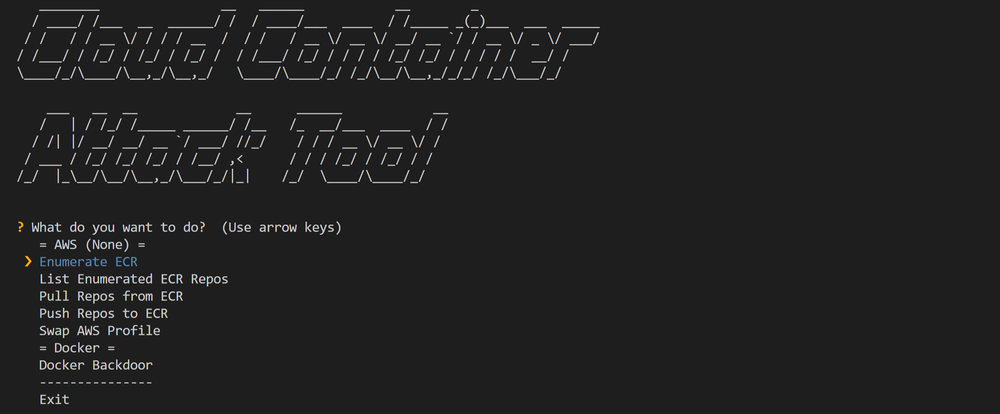
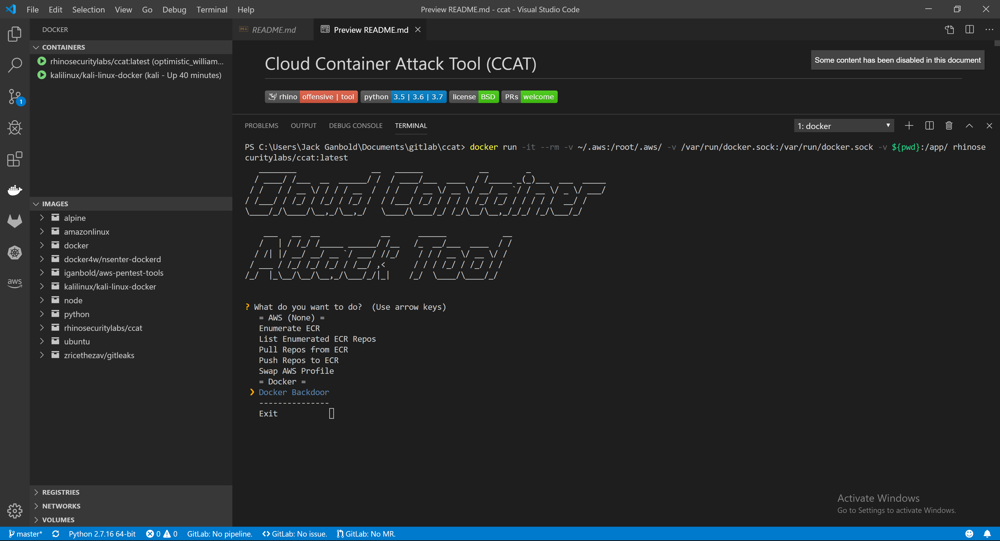

# Cloud Container Attack Tool (CCAT :cloud: :cat2:) 
[![Rhino](https://img.shields.io/badge/rhino-offensive%20%7C%20tool-red?logo=data:image/png;base64,iVBORw0KGgoAAAANSUhEUgAAADYAAAAxCAQAAAA7SZLuAAAABGdBTUEAALGPC/xhBQAAACBjSFJNAAB6JgAAgIQAAPoAAACA6AAAdTAAAOpgAAA6mAAAF3CculE8AAAAAmJLR0QA/4ePzL8AAAAJcEhZcwAACxIAAAsSAdLdfvwAAAAHdElNRQfjCAkMIR33/0eZAAAGdUlEQVRYw+XXa5DWZRkG8GuXBVyE5bSAIowgHtY0E0wzMzE1ZyQVzTIdNTXLQ05OnlKTodDQxulgM5HpWAMxGurIIJhnUhI0DyAlphECogIZCAvL7rLL7q8P+y7uuu/CwuSn7vfb+3+e57qv+7kP15N8wib6GiBJUrr9r4hPBm//XJ6yNmeLHqoM6BrgrrgmxlrpC6KVWZKGlOaGnJeKnR0j6Z/T07PLzCqzby5og1TwdrQXPeVk3YvDiSgz2oNe0LfLMbgOy+yrw4cjvaXanYa18hNRqpdKoxzrMjOsxeLWS98pWImpaDBeET9O8h4WOFqUOdA5JvujZ71utXpN3jRFtfn27CLYQIvU4UeKfIyL1eAtF7nLu7ZpsQbveNh37O1KTFeq+OFR9tGti2NVm2WD+5SWtV9cEsl9OTxX5aDck+5pzvosz9IszYpUpzxLMzzXJnk1zZ2Q6Z+xmZOmFqgkJ6Yks3JE9soeZUWWN+SJfDu9UpO5mZMVGZiqHJJTsjUPZXl+mZFZl/lJSRFeSU7MBXkydduhv5I383IaUlEkf8UgT+NJx+ntbPNs0ehV1xthmMfBLHt0EsSB5lnUkqkiTlNvosH+ZbHKYjG/WqN7DTTEXWptM885Bohh5oBaZxWrRRE3YKF+BbAeHrDeaHtZYZGBxXgtNFM/VZ7GBje39BVDzCqkyiN6dwJ1ovdt8ZxehR4zVrUZuhllrRdUdNwyzmuqfNrL2OgS3USUu6cA9b5jOvIScbDFlnjK/UpF9HS/OuPEkWo8pmfHLRN8zwivoNmtBag4Xx3Y5NJOoPb1jGoXmeuHhT2n2mKWXmI8ft+xqLu73t6GeRHLjCjEvre5BV6TdSsKtZ8n1LvOUZY7Xst1zFPtJBHXY2JHsB6qlIhDPW6DiwsBqbJmO9jHeIkYY746E/Vwq5f0FyUmYooyUeo+nFusXbX++rvUTJfrK0ZbXwB7xWAfj8XZltnoat2N8GYhiCdb7+9GFVJriY3G7KC9iagwxr5iH1eZBraZ0DoTROxvihpLnaWb+LG3HSgOsMhG47XmaJ3XDNxpLy0sLxEj/Q1s9muf1UtPB7vZ2+rNcEhhQL1jkhhstgY3FK4gbse9Sro0bEXsoaev2lgI5npzPeZ9jZ5zdqGqenvIa4YZYLpGv1BeSK7BFuH8Lk72wlFf83WTCwXQajW+vJ371f7jDEM9YKtf6bO9YX1Do5VGdVnfiBjqWTNMtakd3MMqRYy32m1OsMAWt7TOOtHLbPyhY8HsDO5GLPBTL2vcDtbkEWOdZ5U3TLPOKhe2S6BxNqt3xi4qN3G6Rix0pnP9qU1AN6tFoyZzjG43OPt4FPP130WRKMZp0GSzpc7Qxzct1d42OVbb9XGhetuKNbidg52kwRLHmGKd3/i8L/m5lyy3yipbwR3K2oTwAK/jBYOKqY9+zuy89MQoK6zxA7dZhxo/Uaav4UYa4U7NqHZZSyqIPU1DrXOK8BLjrHHkDhRjd5dZpkmdtf7qFsPbyL29PQuqTTJEdDdBA6a21FvHwyaodcwOwCoc4hSnOU6Vvm07gojDLS40tIXucLdNWGj/4rzit3SQkl2/0TjC85rbJMzbjiuaGiKm4qbdfctoaU3XeL5QFEta5lpbayv365J8MeW7B5VkUI7Oe7kyM5O8myvy3MflXlvduDbJ5zImCxTRhDu1kvTLPjk3FdmQ5vwsz3dUlqWtK5MsTXMG5Ird4xYZmaMzPR/m+LybOdmRw+JQa1Hr8i7Onva7y8zECpNs8Y/287xdGCVJ74xIbZLy3JItuV/TLoZSGvOXVOczWZuyTmkV3mWz1WxP2o0mG7oreSniAlMdYJZ/W6JSp8tOtRLNGm21VSOaLHajI/RrUY5dgqtwrX3MpkUTd7QSyadyW5ryRlZmfRqSVOSSnJBukQ1ZkeVZnfXZksZsi5Ql6ZbSJNvSkE1ZnWVZk+aSFocG5qDMzJDcle8WTRDR36CP/BdR6fteVWvnVuefbrdXQRz0Mh21Ti8ejaIXKUkqMyZHpSpD0zc9UxJpzNbUZlM+yIepTWn6Z2QOy/CUZmquSH265Zrcmp55MN/Kll1OL1GqXD+VBhlkgD7KWx+xhTmwn5t8YJ3D9HCNTfhz0eb7v7DCo2OdSaapV+PujwbPJwNX7lHUe8ppeu4IqKzLp3ZudZmX5Hd5JpuzO111F7n1a1HF/7/2X2NRZh03N5mKAAAAJXRFWHRkYXRlOmNyZWF0ZQAyMDE5LTA4LTA5VDEyOjMzOjI5LTA0OjAwAcixjwAAACV0RVh0ZGF0ZTptb2RpZnkAMjAxOS0wOC0wOVQxMjozMzoyOS0wNDowMHCVCTMAAAAASUVORK5CYII=)](https://rhinosecuritylabs.com) [](https://github.com/RhinoSecurityLabs/container-hack) [](https://github.com/RhinoSecurityLabs/container-hack/blob/master/LICENSE) [](https://github.com/RhinoSecurityLabs/ccat/pulls)

_Cloud Container Attack Tool (CCAT) is a tool for testing security of container environments._



## Requirements
* Python 3.5+ is required.
* Docker is required. Note: CCAT is tested with Docker Engine 19.03.1 version.
* AWS named profile is required.

## Installation
<!-- Install CCAT with pip
```
 $ pip install ccat
``` -->

Install CCAT from source

```
  $ git clone https://github.com/RhinoSecurityLabs/ccat.git
  $ cd ccat
  $ python3 setup.py install
  $ python3 ccat.py
```

Use CCAT's Docker Image
> Warning: Running this command will mount your local AWS configuration files into the Docker container when it is launched. This means that any user with access to the container will have access to your host computer's AWS credentials.

> Warning: Running this command will mount your local Unix socket that Docker daemon listens on by default into the Docker container when it is launched. This means that users with access to the container will have access to your Docker daemon, meaning they could escape to your host computer with ease.
```
  $ docker run -it -v ~/.aws:/root/.aws/ -v /var/run/docker.sock:/var/run/docker.sock -v ${PWD}:/app/ rhinosecuritylabs/ccat:latest
```

## Getting Started

### Example Usage

Below is an example scenario to demonstrate the usage of CCAT. 

Starting with compromised AWS credentials, the attacker enumerates and explores ECR repositories. Then, the attacker found that they use NGINX Docker image and pulled that Docker image from ECR. Furthermore, the attacker creates a reverse shell backdoor into the target Docker image. Finally, the attacker pushes the backdoored Docker image to ECR.

#### Exploitation Route:


#### Exploitation Route Walkthrough with CCAT:

> If you prefer a video walkthrough, you can find a link to video below this section.

1. The attacker explores the AWS enviroment and discovers they are able to list ECR repositories using compromised AWS credentianls.

    * Enumrate ECR repositories
      
      

      * Configure AWS CLI Profile

        > The first time CCAT is launched, the attacker will be prompted to configure their AWS CLI profile. This profile will be used to run the related AWS attack modules.
        
        

      * Then the attacker selects target AWS regions
        
        

    * Then the attacker lists enumrated ECR repositories with simple table format
      
      
      
      

2. The attacker finds that they use the NGINX Docker image and pulls that Docker image from ECR.
    
    * Pull ECR repository

      

      * Then there are two options to pull from ECR repositories so the attacker chooses a single repository with multiple tags option 
      
        
      
      * Then the attacker will be promoted to provide AWS region, ECR repository URI, repository tags
      
        

3. The attacker decides to create a reverse shell backdoor into the pulled NGINX Docker image.    
    
    * The attacker starts a listener for reverse shell

      
    
    * Then the attacker creates a reverse shell backdoor

      > This module generates a Dockerfile on the fly and builds new Docker image.

      
    
      * Then the attacker will be promoted to provide repository name, tag and new build tag  

        
      
      * Then the attacker generates a Dockerfile, adds reverse shell configuration, and overwrites the default CMD command

        > "CMD sets default command and/or parameters, which can be overwritten from command line when docker container runs."

        
      
      * Then the attacker reviews a Dockerfile and builds new backdoored NGINX Docker image

        

    * Then the attacker tests the backdoored Docker image 

        * Run a backdoored container
      
          
        
        * Test NGINX server

          

        * Test reverse shell backdoor

          

4. Finally, the attacker pushes the backdoored Docker image to ECR.

      * Check AWS Web Console BEFORE pushing the backdoored Docker image

        
      
      * Push the backdoored Docker image

        
      
        * The attacker will be promoted to provide AWS region, ECR repository URI and repository tag

          

      * Check AWS Web Console AFTER pushing the backdoored Docker image

        

#### Exploitation Route Walkthrough Video with CCAT:
[](https://youtu.be/12zEXfCxIrk "CCAT")

## Roadmap
* Container Escape Features
* Image Scanner Features
* Amazon ECS Attack Features
* Amazon EKS Attack Features
* Azure Container Related Attack Features
* GCP Container Related Attack Features
* OpenShift Container Related Attack Features
* IBM Cloud Container Related Attack Features
* Alibaba Cloud Container Related Attack Features
    

## Disclaimer
* CCAT is tool that comes with absolutely no warranties whatsoever. By using CCAT, you take full responsibility for any and all outcomes that result.
